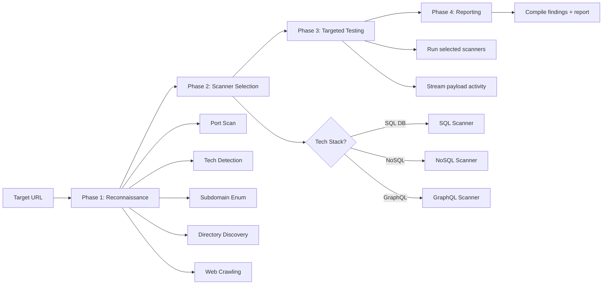

<div align="center">

# 🛡️ Miku Beam Sentinel

### Reconnaissance-First API & Web Security Scanner

[](LICENSE)
[](https://www.python.org/downloads/)
[](https://www.djangoproject.com/)
[](https://react.dev/)
[](#-project-status)
[](https://github.com/MathQnADEV/Miku-Beam-Sentinel/actions/workflows/tests.yml)

[Features](#-key-features) • [Installation](#-installation) • [Usage](#-usage-examples) • [Architecture](#-architecture) • [Roadmap](#-roadmap) • [Disclaimer](#-security-disclaimer)

**Map the attack surface first, then test what actually exists.**
Python scanning engine · Django + Channels backend · React real-time dashboard.

</div>

---

## 📋 Table of Contents

- [Overview](#-overview)
- [Project Status](#-project-status)
- [Key Features](#-key-features)
- [Scan Methodology](#-scan-methodology)
- [Installation](#-installation)
- [Quick Start](#-quick-start)
- [Usage Examples](#-usage-examples)
- [Screenshots](#-screenshots)
- [Architecture](#-architecture)
- [Technology Stack](#-technology-stack)
- [Known Limitations](#-known-limitations)
- [Roadmap](#-roadmap)
- [Contributing](#-contributing)
- [Security Disclaimer](#-security-disclaimer)
- [License & Attribution](#-license--attribution)

---

## 🔍 Overview

**Miku Beam Sentinel** is an API/web security testing framework built around a
**reconnaissance-first** workflow. Instead of blindly firing payloads at a base
URL, the goal is to first map the attack surface — open ports, technology stack,
subdomains, directories, and crawlable URLs — and then run targeted vulnerability
checks against what was discovered.

The project ships two interfaces over a shared Python engine:

- 🖥️ **Web UI** — a React dashboard with live reconnaissance and scan progress streamed over WebSockets.
- 💻 **CLI** — a scriptable command-line runner suitable for automation and CI.

> **Note on the reconnaissance-first design:** the recon → scan handoff is the
> project's core idea and is still being fully wired up. See
> [Known Limitations](#-known-limitations) for an honest picture of what already
> works end-to-end versus what is on the [roadmap](#-roadmap).

### Why this project?

- ✅ **Clean, modular engine** — every recon source and every scanner is an independent, swappable module with a consistent `scan()` / callback contract.
- ✅ **Correct concurrency** — parallel port/subdomain/directory discovery via `ThreadPoolExecutor`, results collected on the main thread.
- ✅ **Real-time UX** — reconnaissance stats and payload activity streamed live to the browser.
- ✅ **Dual interface** — the same engine drives both the web app and the CLI.
- ✅ **Broad coverage surface** — 23 scanner modules spanning the OWASP API Top 10 and common web classes.

---

## 🚦 Project Status

Miku Beam Sentinel is an **actively developed prototype**, not yet a production
security product. It is a great learning and hacking-lab tool and a solid base to
build on. Being upfront about maturity:

| Area | State |
|------|-------|
| Reconnaissance engine (ports, tech, subdomains, dirs, crawl) | ✅ Working |
| Real-time web dashboard + WebSocket streaming | ✅ Working |
| CLI scan runner + JSON/HTML/Markdown reports | ✅ Working |
| Detection soundness (false-positive reduction, baselines, OAST) | 🚧 In progress |
| Recon results driving scanner selection & endpoint testing | 🚧 In progress |
| Async task queue, authentication, production hardening | 🗺️ Planned |

If you are evaluating findings for a real engagement, treat results as **leads to
verify manually** until the detection-hardening milestones on the
[roadmap](#-roadmap) land.

---

## ✨ Key Features

### 🎯 Reconnaissance Phase — Attack Surface Mapping

<table>
<tr>
<td width="50%">

**🔌 Port Scanning**
- Parallel workers (`ThreadPoolExecutor`)
- Identifies common open services
- Feeds the live dashboard

**🔍 Technology Detection**
- Server / header fingerprinting
- Framework & frontend hints
- Backend/database inference

</td>
<td width="50%">

**🌐 Subdomain Enumeration**
- Parallel DNS resolution
- Common-pattern wordlist
- Streamed as discovered

**📂 Directory Discovery**
- Common paths, admin panels, API endpoints
- Status-code aware
- Streamed as discovered

</td>
</tr>
</table>

### 🛡️ Vulnerability Scanners (23 modules)

<details>
<summary><b>🔴 Injection</b></summary>

- **SQL Injection** — 140+ categorized payloads (union / time / boolean / error-based), multi-DB signatures
- **NoSQL Injection** — MongoDB / Redis / Cassandra / CouchDB operators
- **Command Injection** — OS command execution (baseline + timing double-confirm)
- **LDAP / XPath / XML Injection**

</details>

<details>
<summary><b>🟠 Cross-Site Scripting (XSS)</b></summary>

- 110+ payloads — reflected / stored / DOM-oriented, framework and filter-evasion variants
- (Context-aware confirmation is on the [roadmap](#-roadmap).)

</details>

<details>
<summary><b>🟡 Server-Side</b></summary>

- **SSRF** — 50+ payloads incl. cloud-metadata & internal-network targets
- **SSTI** — Jinja2 / Twig / Freemarker style template injection
- **XXE** — XML External Entity attacks

</details>

<details>
<summary><b>🟢 Authentication & Authorization</b></summary>

- **Broken Authentication**, **BOLA/IDOR**, **Broken Access Control**
- **JWT** manipulation checks, **OAuth** misconfiguration checks

</details>

<details>
<summary><b>🔵 API-Specific</b></summary>

- **GraphQL** (introspection / depth / batching), **HTTP Parameter Pollution**
- **Mass Assignment**, **Rate-Limiting** checks

</details>

<details>
<summary><b>🟣 Misconfiguration & Exposure</b></summary>

- **Security Headers**, **Sensitive Data Exposure**, **Business Logic**, **Insufficient Logging**

</details>

### 🔌 Optional External Engine

- **Nuclei** integration (`engine/integrations/nuclei_runner.py`) — automatically used if `nuclei` is found on `PATH`, skipped otherwise.

---

## 🔄 Scan Methodology



| Phase | Progress | Activities |
|-------|----------|------------|
| **🔍 Reconnaissance** | 5–30% | Port scan → Tech detection → Subdomain enum → Directory discovery → Crawling |
| **🎯 Scanner Selection** | 30–35% | Analyze tech stack → select relevant scanners |
| **🛡️ Vulnerability Testing** | 35–85% | Run selected scanners, stream payload activity |
| **📊 Reporting** | 85–100% | Compile results → generate reports |

---

## 🚀 Installation

### Prerequisites
- **Python** 3.8+
- **Node.js** 16+ and npm
- **Git**

### Clone
```bash
git clone https://github.com/MathQnADEV/Miku-Beam-Sentinel.git
cd Miku-Beam-Sentinel
```

### Backend
```bash
# Virtual environment
python3 -m venv venv
source venv/bin/activate        # Linux/Mac
# venv\Scripts\activate         # Windows

# Dependencies
pip install -r requirements.txt

# Configure environment (copy the example and edit as needed)
cp web/backend/.env.example web/backend/.env

# Database (SQLite is fine for local use)
cd web/backend
python manage.py migrate
cd ../..
```

### Frontend
```bash
cd web/frontend
npm install
cd ../..
```

---

## ⚡ Quick Start

### Option 1 — Web Interface 🖥️

WebSockets require an **ASGI** server (Daphne / Channels), so start the backend
with Daphne rather than `runserver`:

**Terminal 1 — Backend**
```bash
cd web/backend
source ../../venv/bin/activate
daphne -b 127.0.0.1 -p 8001 config.asgi:application
```

**Terminal 2 — Frontend**
```bash
cd web/frontend
npm run dev
```

**Open:** http://localhost:5173 (the frontend talks to the backend on port `8001`).

### Option 2 — CLI 💻

```bash
source venv/bin/activate

# Full scan
python -m cli.main -u https://api.target.com --scan-all

# Targeted scan
python -m cli.main -u https://api.target.com --scan-sqli --scan-xss --scan-ssrf

# With authentication
python -m cli.main -u https://api.target.com \
  --auth-type bearer --auth-token "eyJhbGciOi..." --scan-all

# Reports
python -m cli.main -u https://api.target.com --scan-all \
  --report-json report.json --report-html report.html
```

---

## 📚 Usage Examples

### CI/CD gate
```bash
#!/bin/bash
python -m cli.main -u "$TARGET_URL" --scan-all --report-json scan_results.json

CRITICAL=$(jq '[.vulnerabilities[] | select(.severity=="CRITICAL")] | length' scan_results.json)
if [ "$CRITICAL" -gt 0 ]; then
  echo "❌ Found $CRITICAL critical findings. Failing build."
  exit 1
fi
```

---

## 📸 Screenshots

> The screenshots below come from a running instance. Replace them with your own after deploying.

#### Dashboard


#### Reconnaissance — Live Discovery


#### Vulnerability Scanning — Live Payloads


#### Results


#### CLI


---

## 🏗️ Architecture

```
Miku-Beam-Sentinel/
├── engine/                     # Core scanning engine (shared by CLI + web)
│   ├── core/                   # Reconnaissance modules
│   │   ├── target.py           # Target abstraction
│   │   ├── profiler.py         # Orchestrates the recon phase
│   │   ├── port_scanner.py     # Parallel port scanning
│   │   ├── tech_detector.py    # Fingerprinting
│   │   ├── subdomain_enum.py   # DNS-based enumeration
│   │   ├── dir_discovery.py    # Directory/file discovery
│   │   ├── crawler.py          # Web crawling
│   │   └── auth.py             # Authentication handlers
│   ├── scanners/               # 23 vulnerability scanner modules
│   │   ├── base.py             # BaseScanner + Vulnerability
│   │   ├── injection.py        # SQL Injection
│   │   ├── xss.py  ssrf.py  nosql.py  cmdi.py  ssti.py  xxe.py ...
│   │   └── jwt.py  oauth.py  bola.py  access_control.py ...
│   ├── integrations/
│   │   └── nuclei_runner.py    # Optional external Nuclei engine
│   └── reporting/
│       └── reporter.py         # JSON / HTML / Markdown reports
│
├── cli/
│   └── main.py                 # CLI entry point
│
├── web/
│   ├── backend/                # Django REST + Channels (ASGI/WebSockets)
│   │   ├── config/             # Settings, ASGI, URLs
│   │   ├── projects/           # Projects + scan executor
│   │   ├── scans/              # Scans, vulnerabilities, WS consumers
│   │   └── users/              # Accounts
│   └── frontend/               # React + Vite + TailwindCSS
│       └── src/
│           ├── components/     # ScanProgress (live), modals, UI
│           ├── pages/          # Projects, ScanConfig, Reports, ...
│           └── services/api.js # API client
│
├── requirements.txt
├── DEPLOYMENT.md
└── README.md
```

---

## 🛠️ Technology Stack

**Engine:** Python 3, Requests, BeautifulSoup4, `ThreadPoolExecutor`, socket/DNS.
**Backend:** Django 5, Django REST Framework, Channels + Daphne (ASGI/WebSockets).
**Frontend:** React 18, Vite, TailwindCSS, Lucide, Axios.
**Optional:** Nuclei (external engine, auto-detected).

---

## ⚠️ Known Limitations

Being transparent so you can use the tool wisely and contributors know where to help:

- **False positives.** Several scanners currently flag on weak signals (payload
  reflection, generic error strings, single-shot timing). Findings should be
  manually verified. Hardening these with baselines / control requests / OAST is
  the top [roadmap](#-roadmap) priority. `engine/scanners/cmdi.py` already follows
  the intended stricter pattern and is the template for the rest.
- **Recon → scan handoff is partial.** Discovered URLs/directories are not yet fed
  into every scanner (scanners mostly test the base URL with a guessed parameter
  list), and the web UI's smart selection currently reaches a subset of the 23
  modules. Unifying this is in progress.
- **Not hardened for exposure.** The dev build runs with `DEBUG=True` and open API
  permissions, and performs server-side fetches of user-supplied target URLs. Run
  it **locally / in a lab**, not on a public host, until the hardening milestones land.

---

## 🗺️ Roadmap

**Phase 1 — Cleanup & quick wins**
- Repo hygiene for publication, fix the `--gui` launcher to use Daphne, escape HTML report output, remove dead code paths.

**Phase 2 — Detection soundness & architecture**
- Refactor every scanner to the `cmdi.py` pattern (baseline + control + differential), removing circular/weak detections.
- Unify recon → scanning so discovered endpoints and tech drive what gets tested; make all 23 modules reachable.
- Real async task queue (Celery/Redis), Redis channel layer, consistent auth, SSRF guardrails.

**Phase 3 — Ambitious features**
- Built-in **OAST/interaction server** for reliable blind SSRF/XXE/RCE verification.
- **Authenticated scanning** (login recorder / session handling).
- **Plugin API** for scanners + declarative registry, CI + Docker (ASGI), richer reporting.
- Passive discovery (Certificate Transparency), OpenAPI/Swagger & Postman import.

See [`docs/ROADMAP.md`](docs/ROADMAP.md) for the detailed breakdown.

---

## 🧪 Testing

The engine has an offline test suite (no network — scanners are driven through a fake
HTTP session) plus a smoke test that instantiates and runs every scanner, which guards
against crash-on-load regressions.

```bash
pip install -r requirements-dev.txt
pytest -q
```

CI (GitHub Actions) runs the tests, a Django system check, and the frontend build on
every push and pull request — see [.github/workflows/tests.yml](.github/workflows/tests.yml).

---

## 🤝 Contributing

Contributions are welcome — especially detection-soundness improvements.
Open issues are tracked in the [issue tracker](https://github.com/MathQnADEV/Miku-Beam-Sentinel/issues); the [`detection-quality`](https://github.com/MathQnADEV/Miku-Beam-Sentinel/labels/detection-quality) label is the highest-impact place to start.

1. Fork the repo
2. Create a feature branch (`git checkout -b feature/AmazingFeature`)
3. Commit your changes
4. Push and open a Pull Request

```bash
# Run tests
pytest

# Format / lint (frontend)
cd web/frontend && npm run lint
```

---

## 🔒 Security Disclaimer

### ⚠️ Legal and Ethical Use Only

This tool is for **authorized security testing only**.

✅ **DO:** test systems you own; get explicit written permission; follow responsible disclosure; comply with all applicable laws; use controlled/lab environments.

❌ **DON'T:** scan systems without permission; use for malicious purposes; test production systems without approval; violate computer-fraud laws; ignore scope limits.

Unauthorized access to computer systems is illegal. The authors and contributors
are **not responsible for misuse**. By using Miku Beam Sentinel you agree to use it
ethically and legally.

---

## 📄 License & Attribution

Licensed under the **MIT License** — see [LICENSE](LICENSE).

**Miku Beam Sentinel** is maintained by **MathQnADEV**.

This project is a modified fork of **Cerberus API Sentinel**, originally created by
**Sudeepa Wanigarathna** ([@CerberusMrX](https://github.com/CerberusMrX)) and
released under the MIT License. Full credit for the original work goes to the
original author; see [LICENSE](LICENSE) for details.

---

## 🙏 Acknowledgments

- OWASP, for vulnerability classification references
- The security research community, for payload techniques
- Open-source contributors

---

<div align="center">

### ⭐ Star this repository if you find it useful!

**Built for the security community** ♪

[Report Bug](https://github.com/MathQnADEV/Miku-Beam-Sentinel/issues) • [Request Feature](https://github.com/MathQnADEV/Miku-Beam-Sentinel/issues)

</div>
